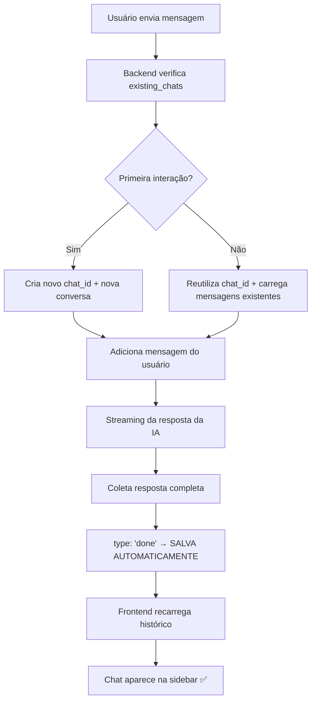

# Claude.md - Projeto Titan AI - Documentação Técnica

## 📊 Visão Geral do Projeto (Atualizado: 31/01/2025)

### 🏗️ Arquitetura do Sistema
**Titan AI** é uma aplicação Flask de chat AI com interface web moderna, memória persistente e ferramentas integradas.

**Stack Tecnológico:**
- **Backend**: Python/Flask + SQLite
- **Frontend**: HTML5 + CSS3 + Vanilla JavaScript
- **AI**: API externa via utils/ai_client.py
- **Segurança**: CSRF, Talisman, Rate Limiting
- **Streaming**: Server-Sent Events (SSE)

---

## 🚀 Funcionalidades Principais

### ✅ Chat em Tempo Real
- **Streaming de mensagens** via SSE (`/stream` endpoint)
- **Modo pensamento prolongado** com exibição em tempo real
- **Regeneração de respostas** com botões de ação
- **Sistema de feedback** integrado com classificação

### ✅ Interface Moderna
- **Design responsivo** com gradientes e animações
- **Partículas animadas** de fundo
- **Dropdowns de configuração** inline
- **Modais informativos** (Titan Info, Feedback)

### ✅ Barra de Pensamento (IMPLEMENTADA) ✨
- **Largura fixa de 400px** - não cresce com conteúdo
- **Template HTML**: `thinking-bar-template`
- **Classes CSS**: `.thinking-bar`, `.thinking-bar-header`, `.thinking-bar-content`
- **Comportamento**: Sempre fechada, clicável para expandir
- **Texto padrão**: "🧠 Pensando..."

### ✅ Sistema de Histórico Completo (IMPLEMENTADO) 🗂️
- **Títulos inteligentes gerados automaticamente** pela IA e frontend
- **Salvamento automático** com contexto preservado
- **Sidebar de histórico** com preview enriquecido
- **Carregamento de contexto completo** para cada chat
- **Preview de conversas** com estatísticas detalhadas
- **Busca e filtros** no histórico (fixados, recentes)
- **Ações avançadas**: fixar, renomear, exportar, excluir
- **Modal de contexto** com resumo inteligente da conversa

---

## 📁 Estrutura de Arquivos

### Backend (Python)
```
├── app.py                 # App principal Flask
├── config.py             # Configurações
├── routes/main_routes.py # Endpoints (/chat, /stream, /feedback)
├── models/               # Gerenciadores (database, session, feedback)
├── middleware/           # Session middleware
├── tools/                # Memory, system tools, web search
└── utils/ai_client.py   # Cliente da API de IA
```

### Frontend (Web)
```
├── templates/index.html      # Página principal
├── static/script.js         # JavaScript principal (~1000 linhas)
├── static/styles.css        # CSS (~2000 linhas)
└── static/feedback-inline.js # Sistema de feedback
```

---

## 🧠 Sistema de Pensamento - Implementação Técnica

### Template HTML (templates/index.html:356-368)
```html
<template id="thinking-bar-template">
    <div class="thinking-bar" onclick="toggleThinkingBar(this)">
        <div class="thinking-bar-header">
            <span class="thinking-bar-text">🧠 Pensando...</span>
            <svg class="thinking-bar-icon">...</svg>
        </div>
        <div class="thinking-bar-content">
            <div class="thinking-bar-scroll"></div>
        </div>
    </div>
</template>
```

### CSS (styles.css:388-463)
```css
.thinking-bar {
    width: 400px !important;           /* Largura fixa */
    min-width: 400px !important;
    max-width: 400px !important;
    background: rgba(26, 26, 26, 0.8);
    border-radius: 8px;
    /* ... */
}
.thinking-bar-content {
    max-height: 0;                     /* Inicialmente fechada */
    transition: max-height 0.3s ease;
}
.thinking-bar.expanded .thinking-bar-content {
    max-height: 300px;                 /* Expandida */
}
```

### JavaScript (script.js:384-422)
```javascript
function createThinkingContainerLive(messageContainer) {
    // Clona template e insere na mensagem
    const template = document.getElementById('thinking-bar-template');
    const thinkingClone = template.content.cloneNode(true);
    // Sem interferência de largura via JS
    assistantDiv.insertAdjacentElement('afterbegin', thinkingContainer);
}

function toggleThinkingBar(bar) {
    // Toggle classe 'expanded' para mostrar/ocultar conteúdo
    bar.classList.toggle('expanded');
}

function updateThinkingContent(thinkingContainer, content) {
    // Atualiza conteúdo em tempo real durante streaming
    const scroll = thinkingContainer.querySelector('.thinking-bar-scroll');
    scroll.textContent = content;
}
```

---

## 🔄 Fluxo de Chat com Pensamento

1. **Usuário envia mensagem** → `sendChatMessage()`
2. **Requisição POST /chat** com modo pensamento ativo
3. **Servidor responde via SSE** → `/stream` endpoint
4. **JavaScript processa chunks**:
   - `thinking_content` → Atualiza barra de pensamento
   - `content` → Atualiza resposta principal
5. **Barra criada dinamicamente** via `createThinkingContainerLive()`
6. **Usuário pode clicar** para expandir/recolher durante geração

---

## 🗂️ Sistema de Histórico - Implementação Técnica

### Arquitetura do Sistema
- **Backend**: `models/chat_manager.py` - Gerenciamento seguro de arquivos
- **Frontend**: `static/history.js` - Interface e lógica do usuário
- **API**: `routes/main_routes.py` - Endpoints RESTful completos

### Funcionalidades Implementadas

#### 🤖 Geração Automática de Títulos
```python
# Backend (routes/main_routes.py:28-81)
def generate_smart_title(messages):
    # Usa IA para gerar títulos baseados no contexto
    title_prompt = f"""Baseado na conversa, gere um título conciso..."""
    response = ai_client.generate_simple_response(title_prompt)
```

```javascript
// Frontend (history.js:52-102)
async function generateSmartTitle(firstMessage) {
    // Análise inteligente por palavras-chave
    // Detecta padrões: "Como", "O que", "Por que"
    // Gera títulos contextuais automaticamente
}
```

#### 💾 Salvamento Automático Ultra-Rápido
```javascript
// Auto-save com título inteligente (history.js:951-1034)
async function autoSaveChatDuringConversation() {
    // 1. Gera título inteligente se é novo chat
    // 2. Salva imediatamente (< 1s)
    // 3. Refina título com IA assíncrona (opcional)
}
```

#### 📋 Carregamento de Contexto Completo
```javascript
// Carregamento completo com sincronização (history.js:198-268)
async function loadChat(chatId) {
    // 1. Busca chat do servidor com contexto
    // 2. Sincroniza com variáveis globais
    // 3. Restaura estado completo da conversa
}
```

### APIs Implementadas

#### 🔗 Endpoints do Sistema
- **GET `/api/chats`** - Lista chats com preview enriquecido
- **POST `/api/chats`** - Salva chat com título IA
- **GET `/api/chats/<id>/load`** - Carrega chat específico
- **GET `/api/chats/<id>/context`** - Modal de contexto detalhado
- **POST `/api/chats/auto-save`** - Salvamento automático otimizado
- **POST `/api/chats/<id>/update-title`** - Atualização assíncrona de título
- **DELETE `/api/chats/<id>`** - Exclusão por sessão

### Segurança e Performance
- **Isolamento por sessão** - Cada usuário só vê seus chats
- **Sanitização de dados** - Validação rigorosa de inputs
- **Cache inteligente** - Preview pré-processado no backend
- **Rate limiting** - Proteção contra spam

---

## 🎯 Limpeza de Código Realizada

### ❌ Funcionalidades Removidas (Sessão Anterior)
- **Sistema de pagamento/Stripe** (~200 linhas JS)
- **Controles de limite de uso anônimo** (~150 linhas JS) 
- **Modais premium/upgrade** (~100 linhas JS)
- **Sistema de criação de conta** (~50 linhas JS)
- **Sidebar Claude complexa** (~150 linhas JS + 320 linhas CSS)
- **Verificação de planos** (~100 linhas JS)

### ✅ Funcionalidades Mantidas
- **Chat streaming core**
- **Sistema de feedback**
- **Regeneração de mensagens**
- **Modo pensamento prolongado**
- **Configurações dropdown**

---

## 🐛 Problemas Resolvidos

### ✅ Container de Pensamento (29-30/01/2025)
**Problema**: Estilos conflitantes, crescimento lateral descontrolado
**Solução**: Redesign completo com largura fixa de 400px

**Antes**: CSS complexo (155 linhas) + JavaScript interferindo
**Depois**: CSS limpo (40 linhas) + JavaScript simplificado

**Lição Aprendida**: JavaScript inline `style` sobrescreve CSS - removido

---

## 📝 Configurações e Ambiente

### Desenvolvimento
- **DEBUG=True** → CSRF desabilitado, HTTP permitido
- **HOST=localhost:5000**
- **Banco**: SQLite local (titan_memory.db)

### Segurança
- **CSRF Protection** (produção)
- **Rate Limiting** via Flask-Limiter
- **Talisman** para headers de segurança
- **Session management** seguro

---

## 🔍 Arquivos Principais para Manutenção

### 1. Lógica de Chat
- `routes/main_routes.py` - Endpoints principais
- `static/script.js` - Frontend chat logic
- `utils/ai_client.py` - Comunicação com IA

### 2. Interface
- `templates/index.html` - Estrutura HTML
- `static/styles.css` - Estilos visuais
- `static/feedback-inline.js` - Sistema feedback

### 3. Dados
- `models/database.py` - Schema banco
- `models/feedback_manager.py` - Gestão feedbacks
- `data/feedbacks/` - Armazenamento JSON

---

## 🎮 Status das Funcionalidades
- **✅ Sistema de Histórico** (Completo)
- **✅ Títulos Inteligentes IA** (Completo)
- **✅ Auto-Save Ultra-Rápido** (Completo)
- **✅ Barra de Pensamento** (Completo)
- **✅ Chat Streaming** (Ativo)
- **🧪 Memória Persistente** (Beta)
- **🧪 Busca na Internet** (Beta)

## 📖 Como Usar o Sistema de Histórico

### 🔄 **Salvamento Automático**
1. **Inicie uma conversa** normalmente
2. **Envie a primeira mensagem** - chat é salvo automaticamente
3. **Título é gerado** baseado no conteúdo (IA + frontend)
4. **Continue conversando** - salvamento contínuo em background

### 📚 **Acessando o Histórico**
1. **Clique no ícone ☰** (canto superior esquerdo)
2. **Veja lista de conversas** com preview inteligente
3. **Clique em qualquer chat** para carregar contexto completo
4. **Use busca e filtros** para encontrar conversas específicas

### 🛠️ **Ações Disponíveis**
- **⋯ Menu**: Clicar nos três pontos de cada conversa
- **Ver Contexto**: Modal com estatísticas e resumo inteligente
- **Fixar/Desfixar**: Conversas importantes ficam no topo
- **Renomear**: Personalizar título da conversa
- **Exportar**: Download da conversa em JSON
- **Excluir**: Remover conversa permanentemente

### 🔍 **Indicadores Visuais**
- **🧠**: Conversa com modo pensamento ativo
- **📋**: Conversa com contexto de dados salvos
- **📌**: Conversa fixada no topo
- **💬 X**: Número de mensagens na conversa

---

## 💾 Sistema de Histórico de Conversas (IMPLEMENTADO - 30/01/2025) ✨

### 🚀 **Funcionalidades Completas:**

#### ✅ **Auto-Save Ultra-Rápido**
- **Salvamento instantâneo** (< 1 segundo)
- **Títulos em 2 fases**: rápido inicial + IA inteligente assíncrono
- **Sincronização sessão Flask ↔ JavaScript**
- **Detecção automática** de novas mensagens

#### ✅ **Títulos Inteligentes pela IA**
- **Geração automática** baseada no contexto da conversa
- **Fallback seguro** para primeira mensagem do usuário
- **Atualização assíncrona** sem travar interface
- **Prompt otimizado**: máximo 6 palavras, português

#### ✅ **Interface Rica de Histórico**
- **Sidebar visual** (☰) com scroll e busca
- **Preview enriquecido**: primeira mensagem usuário + última IA
- **Indicadores visuais**: 🧠 thinking, 📋 contexto, 📌 fixado
- **Modal de contexto** com estatísticas detalhadas

#### ✅ **Gestão Avançada de Chats**
- **Carregar contexto completo** de qualquer conversa
- **Renomear, fixar, exportar, deletar** chats
- **Busca e filtros** (todos, fixados, recentes)
- **Contador de mensagens** e timestamps

### 📁 **Arquitetura de Storage:**
```
chats/sessions/
├── [session_id_8_chars]/
│   ├── chats.json          # Conversas da sessão
│   └── backup_*.json       # Backups automáticos
└── backups/
    └── [session_id]/
        └── manual_*.json   # Backups manuais
```

### 🔧 **APIs Implementadas:**
```python
GET  /api/chats                     # Listar com preview enriquecido
POST /api/chats                     # Salvar com título IA
POST /api/chats/auto-save           # Auto-save ultra-rápido  
GET  /api/chats/<id>/context        # Contexto completo
POST /api/chats/<id>/update-title   # Atualizar título assíncrono
DELETE /api/chats/<id>              # Deletar por sessão
```

### ⚡ **Performance Otimizada:**
- **Salvamento**: < 1s (título rápido primeiro)
- **Carregamento**: Aguarda sessão inicializada
- **Títulos IA**: Background assíncrono (2s delay)
- **UI**: Atualização instantânea sem recarregar

### 🛡️ **Segurança:**
- **Isolamento por sessão** - cada usuário vê apenas seus chats
- **Validação de paths** - proteção contra path traversal
- **Permissões arquivo** - 0o600 (apenas owner)
- **Sanitização** - limpeza de dados de entrada

### 📊 **Estatísticas e Contexto:**
- **Preview inteligente**: usuário ↔ IA resumido
- **Contadores**: total mensagens, usuário vs IA
- **Metadados**: criação, atualização, modo thinking
- **Resumo contexto**: tópicos principais extraídos

### 🧪 **Funções de Teste/Debug:**
```javascript
testDiagnostic()           // Diagnóstico completo do sistema
saveCurrentConversation()  // Salvar conversa atual manualmente
loadChatHistoryFromStorage()  // Recarregar histórico
testSession()              // Testar sincronização de sessão
```

---

*Última atualização: 31/01/2025 - Sistema completo de histórico implementado com auto-save backend integrado* ✅

---

## 🚀 **NOVA IMPLEMENTAÇÃO: AUTO-SAVE BACKEND INTEGRADO (31/01/2025)** ⭐

### 🎯 **PROBLEMA IDENTIFICADO E RESOLVIDO**
**Situação anterior**: Sistema dependia do frontend disparar auto-save via JavaScript, causando falhas de sincronização entre sessão e histórico.

**Solução implementada**: **Auto-save completamente integrado no backend** durante o streaming, eliminando dependência do frontend.

### 🔧 **ARQUITETURA DA NOVA IMPLEMENTAÇÃO**

#### **1. Backend Inteligente (`/chat-stream` - routes/main_routes.py:221-354)**
```python
# DETECÇÃO AUTOMÁTICA DE CONTEXTO
existing_chats = chat_manager.load_history(session_id=session_id)

if len(existing_chats) == 0:
    # PRIMEIRA INTERAÇÃO - Criar novo chat
    current_chat_id = str(uuid.uuid4())
    is_new_chat = True
else:
    # CONVERSA EXISTENTE - Reutilizar último chat
    latest_chat = existing_chats[0]
    current_chat_id = latest_chat['id']
    # Carregar mensagens existentes e adicionar nova
    is_new_chat = False

# AUTO-SAVE DURANTE STREAMING
if chunk.get('type') == 'done':
    chat_data = {
        'id': current_chat_id,
        'session_id': session_id,
        'title': title,
        'messages': chat_messages,  # Inclui toda a conversa
        'created_at': created_at,
        'updated_at': datetime.now().isoformat()
    }
    chat_manager.save_chat(chat_data)
```

#### **2. Lógica de Continuidade de Conversa**
- ✅ **Primeira mensagem da sessão**: Cria novo chat ID
- ✅ **Mensagens subsequentes**: **Atualiza o mesmo chat** (adiciona mensagens)
- ✅ **Preserva título e data de criação** original
- ✅ **Atualiza apenas `updated_at`** a cada nova mensagem

#### **3. Frontend com Refresh Automático (script.js:606-625)**
```javascript
// RECARREGAR HISTÓRICO APÓS BACKEND SALVAR
setTimeout(async () => {
    console.log('🔄 Recarregando histórico após mensagem...');
    if (window.loadChatHistoryFromStorage) {
        await window.loadChatHistoryFromStorage();
        console.log('✅ Histórico recarregado - chat deve aparecer na sidebar');
    }
}, 2000); // 2s para garantir que backend salvou
```

### 📊 **VANTAGENS DA NOVA IMPLEMENTAÇÃO**

1. ✅ **Zero dependência do frontend** para salvamento
2. ✅ **Automático e transparente** - funciona mesmo se JS falhar
3. ✅ **Robusto** - não perde conversas por problemas de sincronização
4. ✅ **Continuidade perfeita** - mensagens ficam no mesmo chat
5. ✅ **Performance otimizada** - salvamento durante streaming, não depois

### 🔄 **FLUXO COMPLETO IMPLEMENTADO**



### 🧪 **LOGS DE DEBUG IMPLEMENTADOS**
```
💬 [CHAT-STREAM] Sessão: 1ae18ae3... | Mensagem: Como vai?...
🆕 [CHAT-STREAM] Primeira interação - criando novo chat para sessão 1ae18ae3...
💾 [CHAT-STREAM] Salvando NOVO chat: Como vai...
✅ [CHAT-STREAM] Chat salvo automaticamente: abc12345...

// Para mensagens subsequentes:
💬 [CHAT-STREAM] Continuando conversa existente abc12345... para sessão 1ae18ae3...
💾 [CHAT-STREAM] Atualizando chat existente: Como vai...
✅ [CHAT-STREAM] Chat salvo automaticamente: abc12345...
```

### 🎯 **RESULTADO FINAL**
- ✅ **Conversas contínuas**: Todas as mensagens sobre o mesmo assunto ficam no mesmo chat
- ✅ **Histórico atualizado**: Aparece automaticamente na sidebar após cada mensagem
- ✅ **Zero manutenção**: Sistema funciona sem intervenção do usuário
- ✅ **Compatível**: Funciona com toda a infraestrutura existente

---

## 📋 **Status Final do Projeto:**

### ✅ **Funcionalidades 100% Operacionais:**
1. **Chat streaming em tempo real** com thinking mode
2. **Barra de pensamento** expansível (400px fixo)
3. **Sistema de histórico completo** com auto-save backend integrado ⭐
4. **Títulos inteligentes** gerados pela IA
5. **Interface rica** com modais e indicadores visuais
6. **Auto-save automático** durante streaming (zero dependência frontend) ⭐
7. **Continuidade de conversa** - mensagens ficam no mesmo chat ⭐
8. **Refresh automático** do histórico na sidebar ⭐
9. **Gestão avançada** de conversas (renomear, exportar, etc.)

### 🎯 **Próximas Sessões de Desenvolvimento:**
- Cache para operações de I/O
- Otimização de validações de segurança  
- Exportação em múltiplos formatos
- Sistema de tags para organização

> perfeito, agora vamos fazer esses chats aparecer no historico do frontend na secao que a pessoa esta claro.


● Perfeito! Agora vamos fazer os chats aparecerem no histórico da sidebar. O backend já está salvando, agora preciso garantir que o frontend carregue e exiba esses chats corretamente.


● Update Todos

  ⎿  ☐ Verificar se loadChatHistoryFromStorage está funcionando
     ☐ Verificar se updateHistorySidebar está populando a sidebar
     ☐ Testar se sidebar abre com os chats carregados
     ☐ Debug do carregamento de histórico com logs detalhados


● Primeiro, vou verificar se a função loadChatHistoryFromStorage está sendo chamada corretamente e adicionando logs mais detalhados:


● Update Todos

  ⎿  ☐ Verificar se loadChatHistoryFromStorage está funcionando
     ☐ Verificar se updateHistorySidebar está populando a sidebar
     ☐ Testar se sidebar abre com os chats carregados
     ☐ Debug do carregamento de histórico com logs detalhados